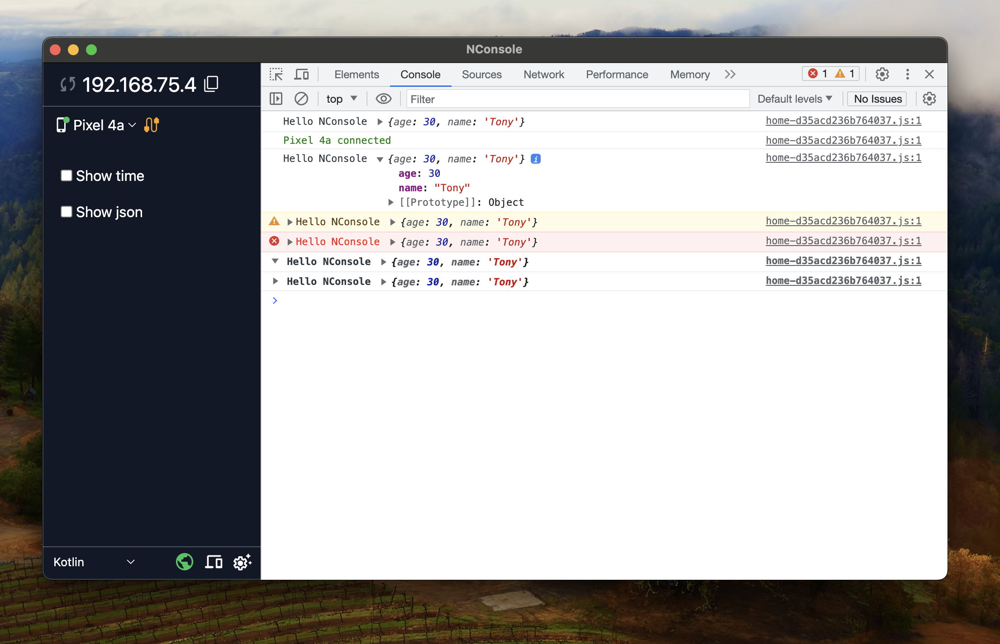

# Console log package



## Usage

- Download [`ServerLog`](https://github.com/Nghi-NV/logger-console/blob/main/assets/example.png) application for mac os, window and linux

In the main.dart set `logEnable = true` for release mode 
```dart
Console.logEnable = true;
```

With android device, you need connect to ip of ServerLog app desktop server
```dart
Console.host = "Server Log IP";
```

```dart
import 'package:logger_console/logger_console.dart';
  
onShowLog() {
  Console.log("string or object...");

  Console.log([
    {"color": "red", "value": "#f00"},
    {"color": "green", "value": "#0f0"},
    {"color": "blue", "value": "#00f"},
    {"color": "cyan", "value": "#0ff"},
    {"color": "magenta", "value": "#f0f"},
    {"color": "yellow", "value": "#ff0"},
    {"color": "black", "value": "#000"},
  ]);

  Console.log("data", [
    {"color": "red", "value": "#f00"},
    {"color": "green", "value": "#0f0"},
    {"color": "blue", "value": "#00f"},
    {"color": "cyan", "value": "#0ff"},
    {"color": "magenta", "value": "#f0f"},
    {"color": "yellow", "value": "#ff0"},
    {"color": "black", "value": "#000"},
  ]);
}
```


